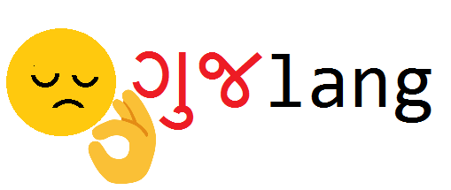
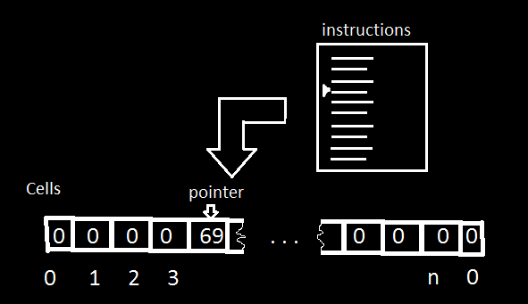

# GUJLANG
  

GUJLANG  is an esoteric programming language in which the program is written in gujarati!  
## Usage
clone the repo and add `guj` in `\bin` folder to `PATH` or to the folder you want to run it, or compile `interpreter.c` using `gcc` and use the command:
```
guj <file>
```

## Syntax
GUJLANG has nine different instructions as of now. Those are:
```
આગળ
પાછળ
વધારો
ઘટાડો
તપાસો
છાપો
સંપૂર્ણ છાપો	
ઇનપુટ	
ડબલ
```
These are provided in the `instructions.txt`  
Each instruction has to be printed on different lines without extra whitespaces or newlines. The last line wouldn't be executed, so it can be blank or a comment.  
It consists of 3001 cells with value zero by default. A pointer, currently pointing at first cell. Instructions are executed line-by-line controlling the movement of the pointer.  


`આગળ` command moves the pointer to the cell ahead of it and sends it to first if current pointer is last one.  
`પાછળ` command moves the pointer to the cell  beforeit and sends it to last if current pointer is first one.  
`વધારો` command increments the value of current cell by 1.  
`ઘટાડો` command decrements the value of current cell by 1.  
`તપાસો` command would jump to instruction with index (zero-based indexing) equal to value in `cell[0]` if current cell is zero and `cell[1]` if it is non-zero.  
`છાપો` command prints the value in current cell in ASCII.  
`સંપૂર્ણ છાપો` command prints the value in all non-zero cells in ASCII.  
`ઇનપુટ` sets the value of current cell to value taken from user(integer).  
`ડબલ` doubles the value in current cell.

more instructions may be added in future (if I have time).
